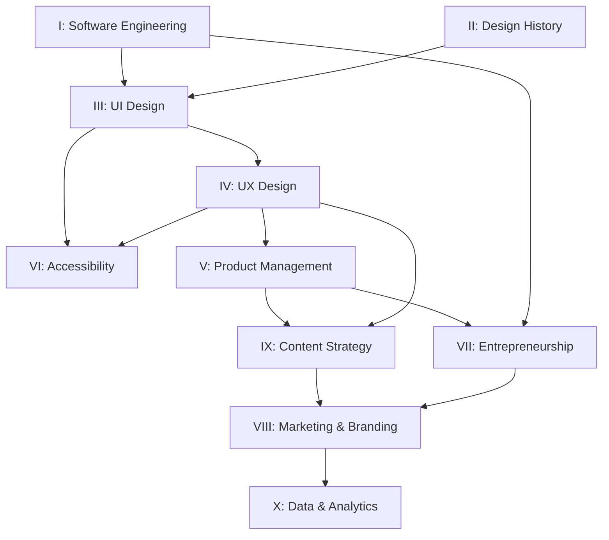

# Series Architecture

## Unified Chapter Convention

Every chapter across all 10 books follows this structure. No exceptions.

### Structure

```
# Chapter N — [Title]

## The Practitioner(s)
  → 1-2 pages. Who they were, what broke, what frustrated them.
  → Ends with: "What frustrated them: [one sentence]"

## The Principle
  → 2-3 pages. The named vocabulary they introduced.
  → What the principle solves. What violating it costs.

## The Engineering Connection
  → 2-3 pages. How this principle maps to modern code.
  → CSS, TypeScript, React, infrastructure — whatever applies.

## Repository Example
  → 1 page. A concrete code example from this project.
  → Before/after if applicable. Executable if possible.

## Chapter Checklist
  → 3-5 bullet points. Each is a verifiable claim.
  → "Can you prove X? If not, your implementation violates Y."
```

### Targets

- **Word count:** 8,000–12,000 per chapter
- **Practitioner depth:** Minimum 500 words per practitioner profile
- **Code examples:** Minimum 1 executable example per chapter
- **Checklist items:** Minimum 3, maximum 5

---

## Dual-Format Output Strategy

Every completed book produces two outputs:

### 1. Human Book (Markdown chapters)
- Full narrative with practitioner stories
- Code examples with explanation
- Exercises and checklists
- Located in: `docs/{book-name}/chapters/`

### 2. LLM Context Pack (Dense specifications)
- No narrative, no stories — pure constraints
- Named patterns with minimal code
- Anti-pattern catalog
- Decision trees
- Located in: `docs/{book-name}/.context/`

### Context Pack Structure

```
.context/
├── PRINCIPLES.md      ← "ALWAYS do X. NEVER do Y."
├── PATTERNS.md        ← Named patterns + 3-line code examples
├── ANTI-PATTERNS.md   ← "DO NOT: [pattern]. INSTEAD: [pattern]."
├── DECISIONS.md       ← "IF [condition] THEN [action]"
└── VOCABULARY.md      ← Term definitions, 1 sentence each
```

---

## Series Order and Dependencies



---

## Editorial Quality Standard

Every chapter is subject to an editorial sprint after drafting:

1. **Sprint document** identifies: Critical Issues, Substantive Concerns, Minor Issues, Strengths
2. **Author addresses** all Critical and Substantive items
3. **Sprint renamed** to `-complete` when resolved
4. **Chapter word count** verified against 8-12K target
5. **Practitioner depth** verified against 500-word minimum

---

## Companion Website Integration

Each book maps to website features:

| Book | Website Feature |
|---|---|
| Design History | Temporal Interface (Theme Switcher) |
| UI Design | Component Showcase |
| UX Design | User Journey Visualizer |
| Software Engineering | Audit-to-Sprint Interactive Demo |
| Accessibility | Live WCAG Dashboard |
| All Books | Interactive Book Reader (`/book/[series]/[chapter]`) |
| All Books | LLM Context Pack Browser |
