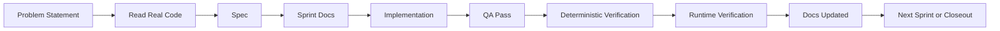
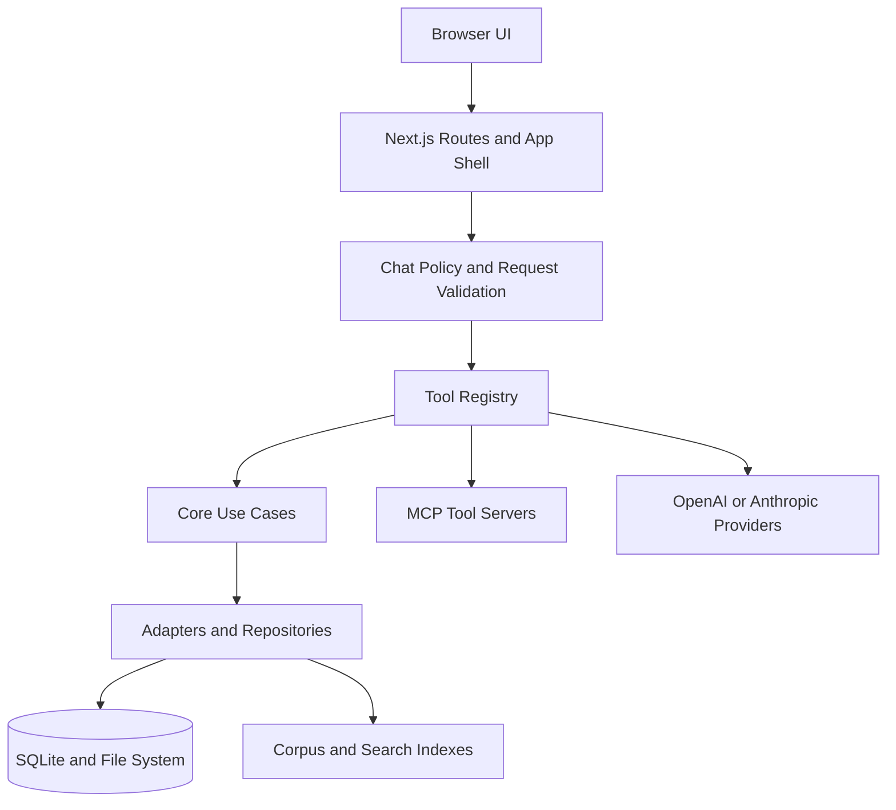
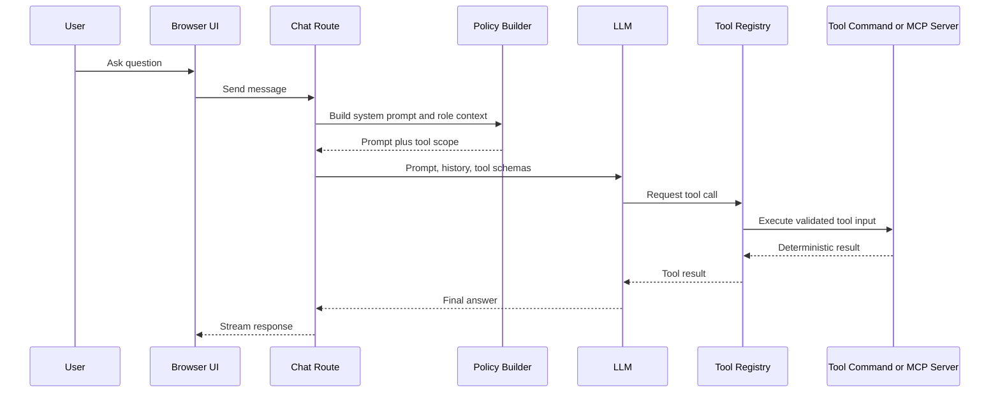

# Architecture Diagrams

This page gives students a visual map of how the repository is organized and how work flows through it. Read this after the root README and the agentic delivery playbook.

## 1. Delivery Workflow

This is the core project loop for shipping changes without letting the model drift away from the problem.

Key lesson: the chat history is not the source of truth. The spec, sprint docs, tests, and verification results are.

## 2. Runtime Architecture

This is the main request path for the application.

Key lesson: MCP is one boundary inside the system, not the whole system. Policy, RBAC, validation, and storage still matter.

## 3. Tool Orchestration Model

The model does not call arbitrary code. It works through a constrained registry and explicit tool contracts.

Key lesson: tool orchestration is useful only when the tools are constrained, typed, and testable.

## 4. Docs Map

Use the docs tree by intent:

- `docs/_specs/`: feature contracts and sprint plans
- `docs/_refactor/`: multi-file remediation programs for known defects or integrity issues
- `docs/operations/`: workflow, runtime, and operational guidance
- `docs/_reference/`: external notes that inform work but do not define product behavior
- `docs/_corpus/`: content and corpus material used by the application

## Suggested Reading Order

1. `README.md`
2. `agentic-delivery-playbook.md`
3. `architecture-diagrams.md`
4. `../_specs/README.md`
5. one completed or active feature spec plus its sprint docs